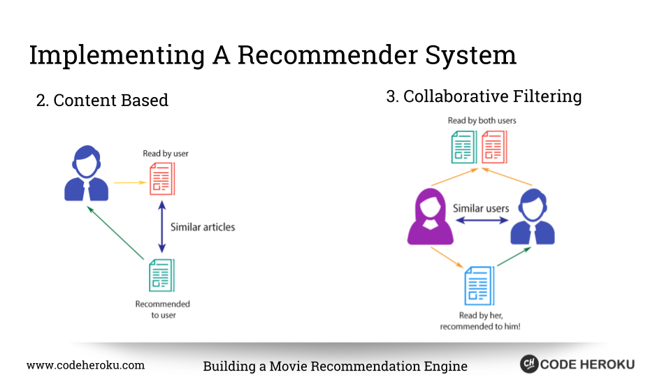
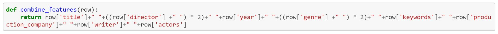

# what-to-watch: Movie Reccomendations Project

In this project we created both a colaberative and a content based reccomendation system.

We used Kaggle and OMDB for data, and used Python, Pandas, machine learning with Scikit-learn, HTML5, JavaScript, CSS, a little D3.js, and jQuery.

The content based system worked by comparing the movie the user entered with a number of features of the movie, such as director, actors, genre, etc. And then showing the movies that have the most similarties among the compared features.

You can visit and try out our content reccomendation system at: https://ucb-what-to-watch.herokuapp.com/

The colaberative based system worked by comparing a users profile of liked movies to other users with similar likes, and then providing a list of recomendations based on the similarities found. When using this enter a number, and you can see what movies that user would like.

You can visit and explore our colaberative reccomendation system at: https://movieusers.herokuapp.com/
